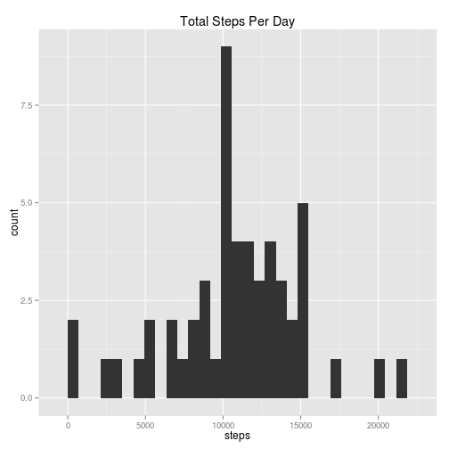
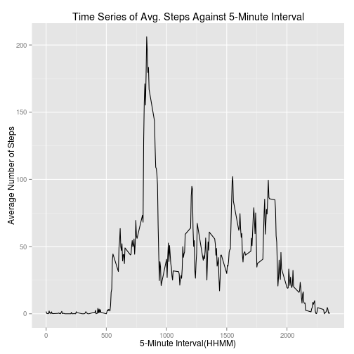
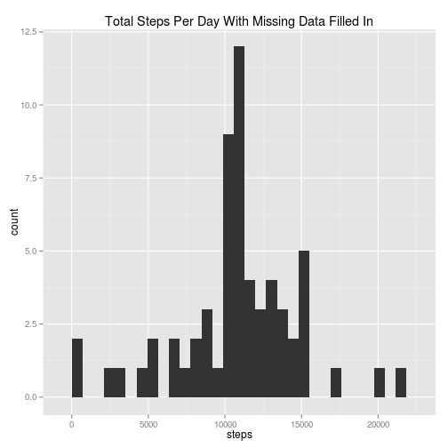
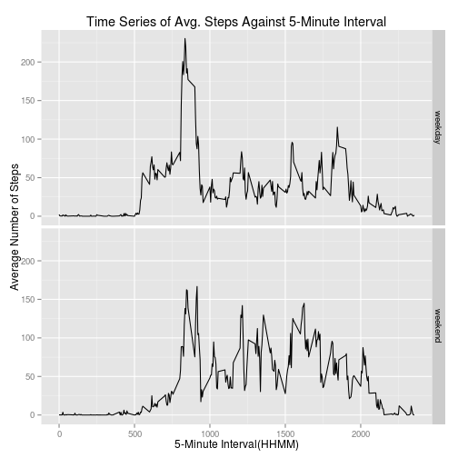

## Loading and preprocessing the data

##### 1. Load the data


```r
## Import the necessary libraries
library(data.table)
library(ggplot2)
library(plyr)

## Read the CSV file
data <- read.csv(file = "activity.csv")
```

##### 2. Transform the data into a format suitable for analysis


```r
stepsData <- as.data.table(x = data)
```

## What is mean total number of steps taken per day?

##### 1. Calculate the total number of steps taken per day


```r
totalSteps <- aggregate(formula = steps ~ date, FUN = sum, data = stepsData)
```

A portion of the `totalSteps` is as follows


```
##         date steps
## 1 2012-10-02   126
## 2 2012-10-03 11352
## 3 2012-10-04 12116
## 4 2012-10-05 13294
## 5 2012-10-06 15420
## 6 2012-10-07 11015
```
##### 2. Make a histogram of the total number of steps taken each day


```r
qplot(x = steps, data = totalSteps, geom = "histogram", main = "Total Steps Per Day")
```

 

##### 3. Calculate the mean and median of the total number of steps taken per day


```r
stepsMean <- mean(x = totalSteps$steps, na.rm = TRUE)
stepsMedian <- median(x = totalSteps$steps, na.rm = TRUE)
```

The **mean** of the total number of steps taken per day is **10766.19** & the **median** of the total number of steps taken per day is **10765**.

## What is the average daily activity pattern?

##### 1. Make a time series plot of the 5-minute interval and the average number of steps taken, averaged across all days


```r
## Calculate the average number of steps taken in the 5-minute interval
averageSteps <- ddply(.data = stepsData, .variables = "interval", .fun = summarise, steps = mean(steps, na.rm = TRUE))

## Create the plot
qplot(x = interval, y = steps, data = averageSteps, geom = "line", xlab = "5-Minute Interval(HHMM)", ylab = "Average Number of Steps", main = "Time Series of Avg. Steps Against 5-Minute Interval")
```

 

##### 2. Which 5-minute interval, on average across all the days in the dataset, contains the maximum number of steps?


```r
## Find the index of the maximum of steps
index <- which.max(x = averageSteps$steps)

## Get the interval located at the index
maxInterval <- stepsData$interval[index]
```

The interval with maximum number of steps is 835.

## Imputing missing values

##### 1. Calculate and report the total number of missing values in the dataset


```r
countNA <- sum(is.na(stepsData[,steps]))
```

*Total number of missing values* in the dataset is **2304**

##### 2.  Fill in all of the missing values in the dataset with the average 5-minute interval values and create a new dataset with all the missing data filled in

We are replacing the NA values with the average 5-minute interval values. We use `ceiling` here to round off the average 5-minute interval values. The new dataset with the missing values filled in is named `completeStepsData`


```r
## Get the steps column from the dataset
stepCount <- data.frame(stepsData[,steps])

## Replacing NA values with the average 5-minute interval values
stepCount[is.na(stepCount),] <- ceiling(tapply(X = stepsData[,steps], INDEX = stepsData[,interval], FUN = mean, na.rm = TRUE))

## Create a new dataset combining the columns
completeStepsData <- cbind(stepCount, data[,2:3])
colnames(completeStepsData) <- colnames(data)
```

A portion of the new dataset `completeStepsData` with all the missing data filled in is as follows


```
##   steps       date interval
## 1     2 2012-10-01        0
## 2     1 2012-10-01        5
## 3     1 2012-10-01       10
## 4     1 2012-10-01       15
## 5     1 2012-10-01       20
## 6     3 2012-10-01       25
```

##### 4. Make a histogram of the total number of steps taken each day and Calculate and report the mean and median total number of steps taken per day

###### Total number of steps taken each day(with  missing values filled in)


```r
newTotalSteps <- aggregate(formula = steps ~ date, FUN = sum, data = completeStepsData)
```

A portion of the `newTotalSteps` is as follows


```
##         date steps
## 1 2012-10-01 10909
## 2 2012-10-02   126
## 3 2012-10-03 11352
## 4 2012-10-04 12116
## 5 2012-10-05 13294
## 6 2012-10-06 15420
```

###### Histogram of the total number of steps taken each day(with  missing values filled in)


```r
qplot(x = steps, data = newTotalSteps, geom = "histogram", main = "Total Steps Per Day With Missing Data Filled In")
```

 

###### Calculate the mean and median of the total number of steps taken per day(with  missing values filled in)


```r
newStepsMean <- mean(x = newTotalSteps$steps, na.rm = TRUE)
newStepsMedian <- median(x = newTotalSteps$steps, na.rm = TRUE)
```

The **mean** of the total number of steps taken per day is **10784.92** & the **median** of the total number of steps taken per day is **10909.00**.

## Are there differences in activity patterns between weekdays and weekends?


```r
## Create a new data frame with a column for the type of the day
day.name <- weekdays(as.POSIXct(completeStepsData$date))
day.type <- ifelse(day.name == "Saturday" | day.name == "Sunday", "weekend", "weekday" )
weeklySteps <- cbind(completeStepsData, day.type)

## Calculate the average steps for 5-minute intervals for weekend and weekday
newAverageSteps <- ddply(.data = weeklySteps, .variables = c("interval", "day.type"), .fun = summarise, steps = mean(steps))

## Plotting
qplot(x = interval, y = steps, data = newAverageSteps, geom = "line", xlab = "5-Minute Interval(HHMM)", ylab = "Average Number of Steps", main = "Time Series of Avg. Steps Against 5-Minute Interval", facets = day.type ~ .)
```

 
